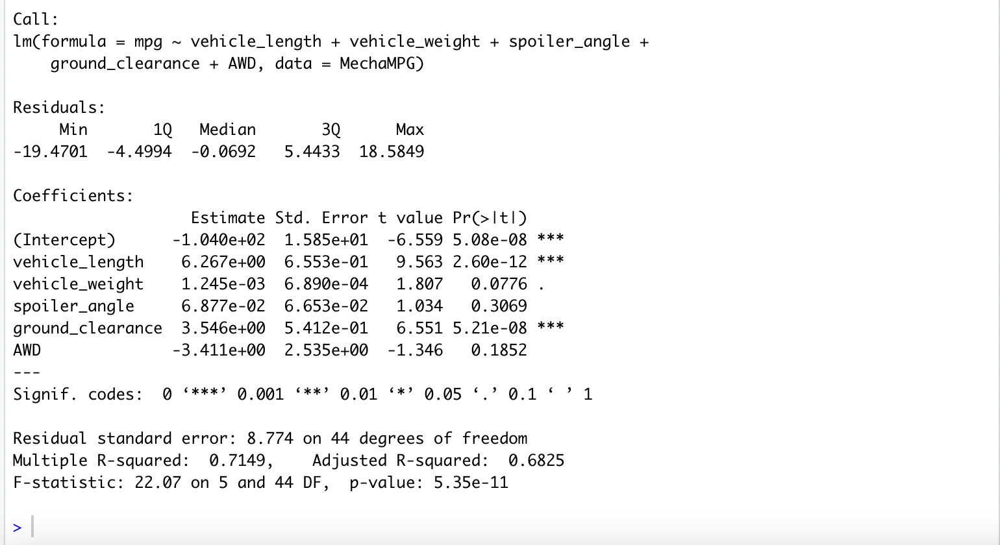
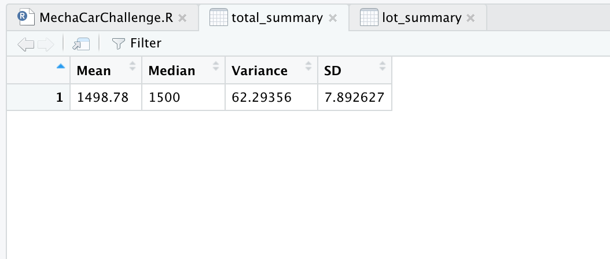
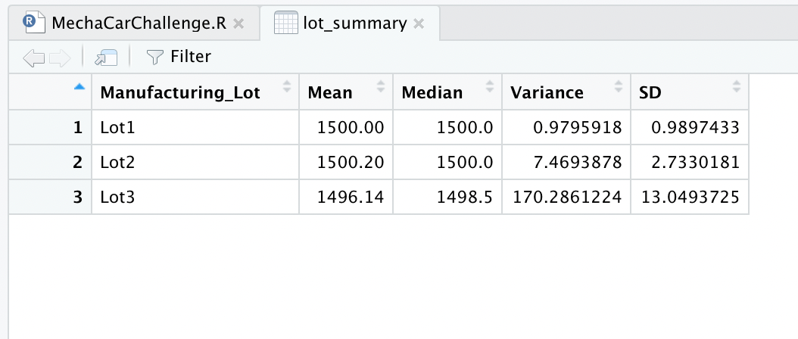
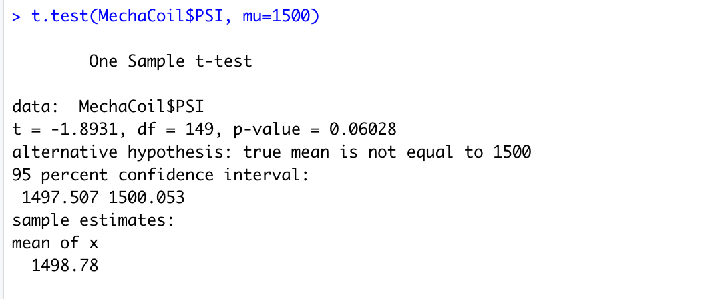
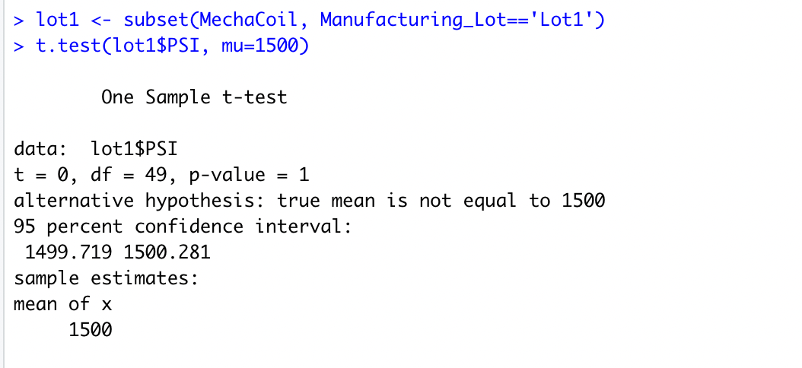
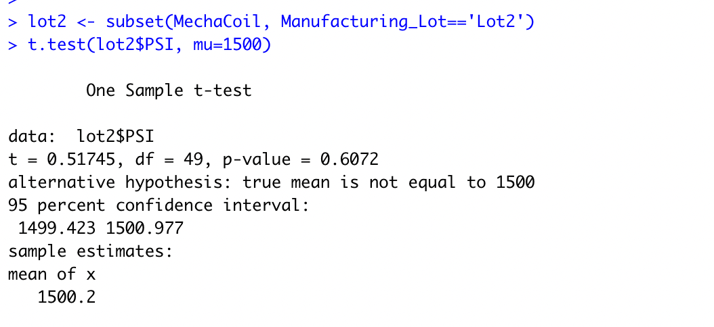
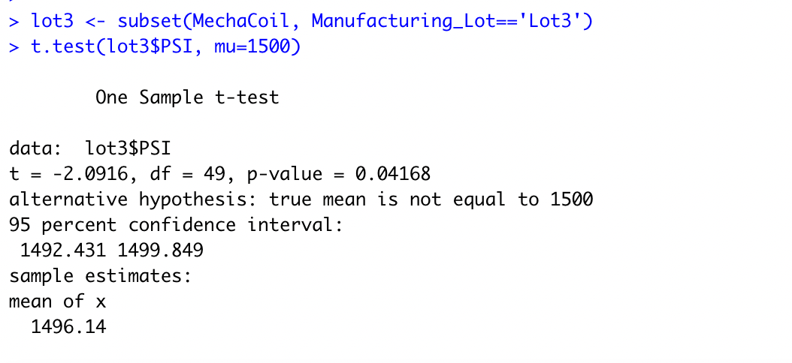

## MechaCar_Statistical_Analysis

## Overview
### The scope of this project was to assist the upper manangement of AutosRUs' to help with the manufacture of the MechaCar prototype. This involved reviewing automotive data using R and its statistics tools for 3 deliverables and a design of a future study.

### This project used Linear Regression to predict MPG, Summary Statistics and T-Tests on Suspension Coils, and lastly designed a study to test more variables.

## Results:

## Linear Regression to Predict MPG

For this deliverable, we read the data into R. Then we ran a Linear Regression to come up with a model to predict MPG when other attributes (Vehicle Weight, AWD, Spoiler etc.) are changed.

According to our results below, vehicle length and ground clearance (as well as intercept) are statistically unlikely to provide random amounts of variance to our model showing our two most imporantant factors for future prototypes. Vehicle weight is CLOSE to being statistically unlikely however is is outside of our P-value of .05.

With an R-Squared of .71, we have sufficent evidence to say that the slope is not equal to 0. 

I would say with our R-Squared of .71, this is a pretty good model for prediction although future models could add or remove variables to see how their P-Values and R-squared changes. 

## Summary Statistics on Suspension Coils

The design specifications for the MechaCar suspension coils dictate that the variance of the suspension coils must not exceed 100 pounds per square inch. Below is the summary statistics for the total of all suspension coils and also broken down by Lot number.

As we can see, just looking at the overall total, we are in acceptable range for staying under 100PSI (orverall variance of 62.3). However when we look deeper into the data and specific lots, we see two lots that look good and one lot that appears to be unacceptable. Lot 3's variance of 170.3 exceeds our 100PSI limit and could result in injuries.

## T-Tests on Suspension Coils

Based on the results of our t-tests, we can conclude that since the p-value of .06 is above our significance level of .05, we do not have enough evidence to reject the null hypothesis.

Broken down by lot, we can see that Lot 3 however is different as it's p-value is lower than .05. In this case, as with the last, we can see that we do have evidence to reject the null hypothesis for Lot 3 and that its true mean is not 1500PSI.

## Study Design: MechaCar vs Competition

With the price of everything seeming to rise, today's (and the future's) consumers will be a lot more cost conscious. Another metric to test the MechaCar against the competition would be upfront cost vs frequency (and maybe costs) of repairs needed.

We would use a calculation to determine Cost/repairs(# or $) for the MechaCar and for our competition. We would need to gather new car pricing (at the time of purchase), and subsequent repair data (cost or frequency or both).

Our null hypothesis is that there is no difference between the cost and repairs for the MechaCar and all groups are equal. The alternative hypothesis is that there is a difference (positive or negative).

I would use an ANOVA test to study the results since we would be comparing the means (Cost/repairs) across multiple data sets. This would either tell us the groups are equal or they are not which would limit our understanding of the data. I would also combine the ANOVA with t-tests for manufacturer and model.

At the very least it could help prove or disprove the age old addage "You get what you pay for."
